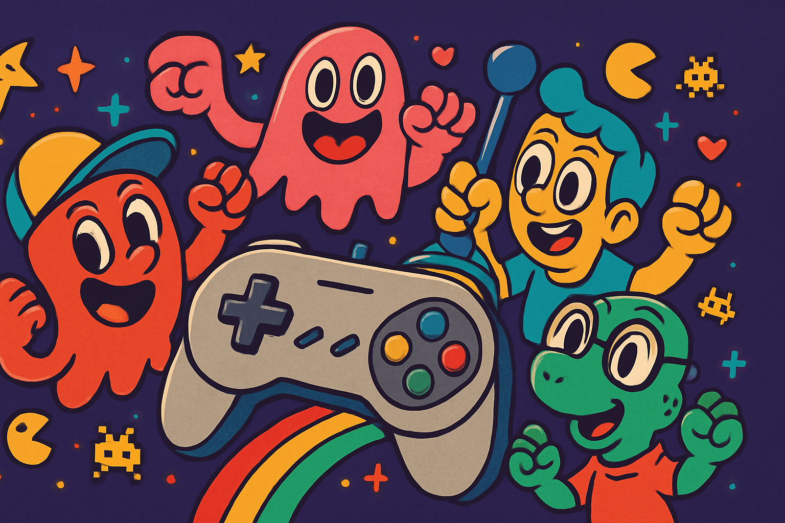

# 🎮 Mini Game Site 🎮

<p align="center">
  <a href="https://mini-game-site.vercel.app/">
    
  </a>
</p>

<p align="center">
  A modern web-based gaming platform built with Next.js, featuring classic arcade games reimagined with modern web technologies.
</p>

<p align="center">
  <a href="https://mini-game-site.vercel.app/">View Demo</a>
  ·
  <a href="https://github.com/Kaustubh0912/mini_game_site/issues">Report Bug</a>
  ·
  <a href="https://github.com/Kaustubh0912/mini_game_site/issues">Request Feature</a>
</p>

<p align="center">
  
  
  
  
  
  
</p>

---

## 📖 Table of Contents

- [About the Project](#-about-the-project)
- [Features](#-features)
- [Getting Started](#-getting-started)
- [Technology Stack](#-technology-stack)
- [Project Structure](#-project-structure)
- [Contributing](#-contributing)
- [License](#-license)
- [Contact](#-contact)

---

## 🌟 About the Project

This project is a web-based gaming platform that brings classic arcade games to the modern web. It's built with a focus on performance, user experience, and modern web development practices.

---

## ✨ Features

- **Classic Games:**
  - **Snake:** The timeless classic where you grow a snake by eating food.
  - **Tic-Tac-Toe:** A simple yet strategic game for two players.
  - **Breakout:** A retro arcade game where you break bricks with a ball and paddle.
  - **Wordle:** A modern word-guessing game.
- **User Authentication:** Secure user registration and login using NextAuth.js.
- **User Profiles:** Personalized user profiles with game statistics and leaderboards.
- **Responsive Design:** A fully responsive layout that works on all devices.
- **Dark Mode:** A sleek dark mode for comfortable gaming at night.
- **Real-time Updates:** Real-time game state management for a seamless experience.

---

## 🚀 Getting Started

To get a local copy up and running, follow these simple steps.

### Prerequisites

- Node.js (v18 or later)
- npm or yarn

### Installation

1.  **Clone the repository:**
    ```sh
    git clone https://github.com/Kaustubh0912/mini_game_site.git
    ```
2.  **Navigate to the project directory:**
    ```sh
    cd mini_game_site
    ```
3.  **Install dependencies:**
    ```sh
    npm install
    ```
4.  **Set up environment variables:**
    Create a `.env.local` file in the root of the project and add the following:
    ```env
    NEXTAUTH_URL=http://localhost:3000
    NEXTAUTH_SECRET=your_secret_key
    MONGODB_URI=your_mongodb_uri
    ```
5.  **Run the development server:**
    ```sh
    npm run dev
    ```
6.  **Open your browser:**
    Navigate to `http://localhost:3000`.

---

## 🛠️ Technology Stack

This project is built with a modern and robust technology stack:

- **Frontend:**
  - [Next.js](https://nextjs.org/) 15
  - [React](https://reactjs.org/) 19
  - [Tailwind CSS](https://tailwindcss.com/) 3
  - [TypeScript](https://www.typescriptlang.org/) 5
- **Backend:**
  - [Next.js API Routes](https://nextjs.org/docs/api-routes/introduction)
- **Authentication:**
  - [NextAuth.js](https://next-auth.js.org/) 4
- **Database:**
  - [MongoDB](https://www.mongodb.com/) 5
- **Deployment:**
  - [Vercel](https://vercel.com/)

---

## 📦 Project Structure

```
mini_game_site/
├── components/       # Reusable UI components
├── games/            # Game-specific components and logic
├── lib/              # Helper functions, database connection, etc.
├── pages/            # Next.js pages and API routes
├── public/           # Static assets (images, fonts, etc.)
├── styles/           # Global styles and Tailwind CSS configuration
└── types/            # TypeScript type definitions
```

---

## 🤝 Contributing

Contributions are what make the open-source community such an amazing place to learn, inspire, and create. Any contributions you make are **greatly appreciated**.

1.  **Fork the Project**
2.  **Create your Feature Branch** (`git checkout -b feature/AmazingFeature`)
3.  **Commit your Changes** (`git commit -m '''Add some AmazingFeature'''`)
4.  **Push to the Branch** (`git push origin feature/AmazingFeature`)
5.  **Open a Pull Request**

---

## 📝 License

Distributed under the MIT License. See `LICENSE` for more information.

---

## 📧 Contact

Your Name - [kaustubharun2003@gmail.com](mailto:kaustubharun2003@gmail.com)

Project Link: [https://github.com/Kaustubh0912/mini_game_site](https://github.com/Kaustubh0912/mini_game_site)